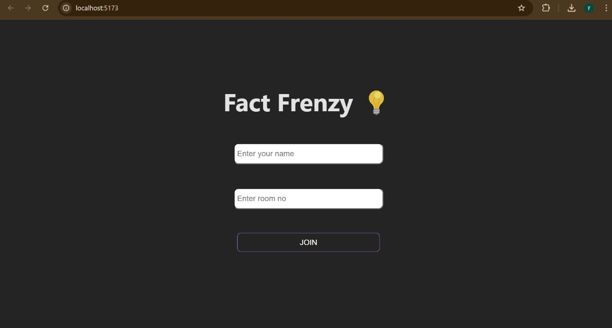
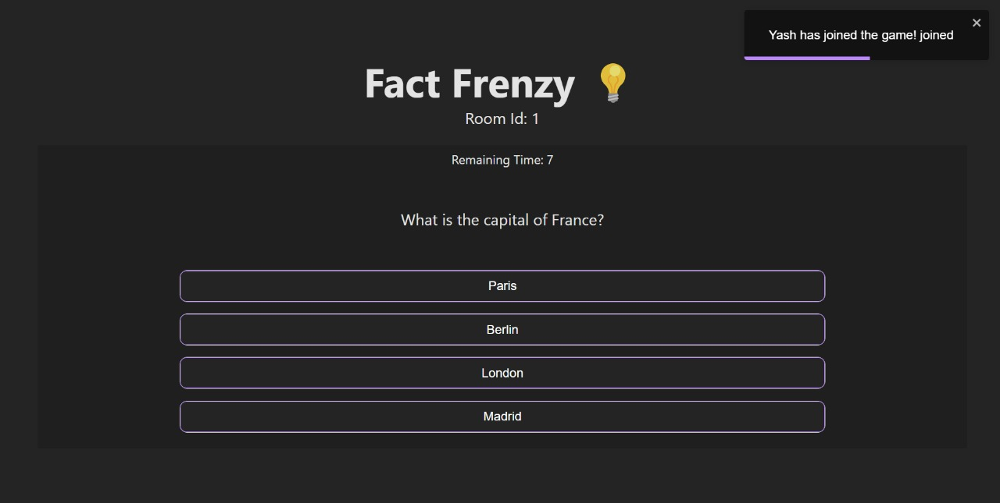
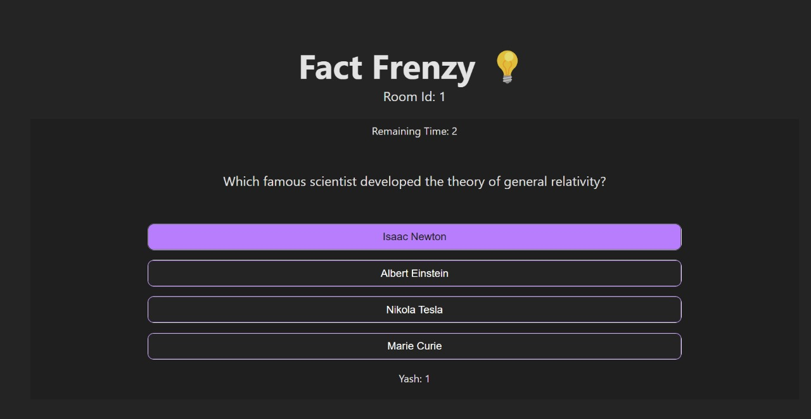
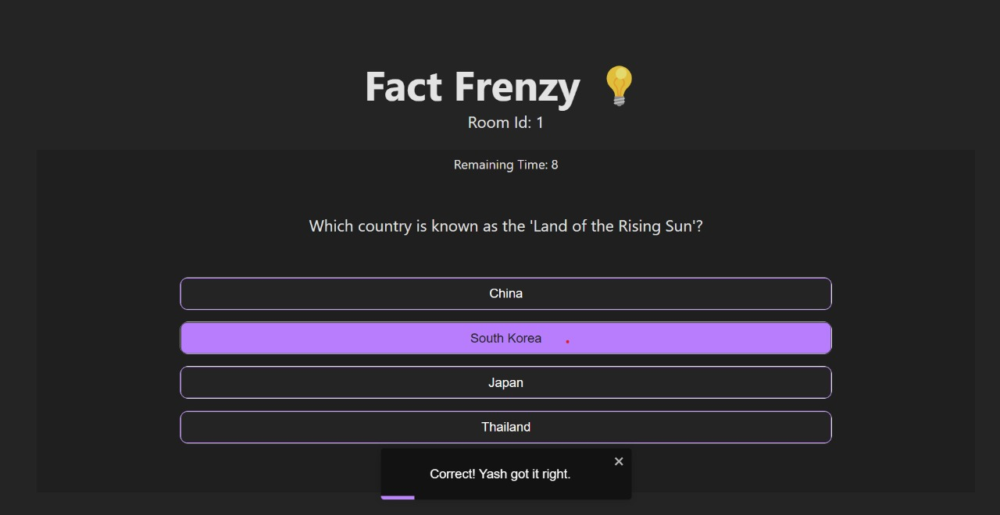
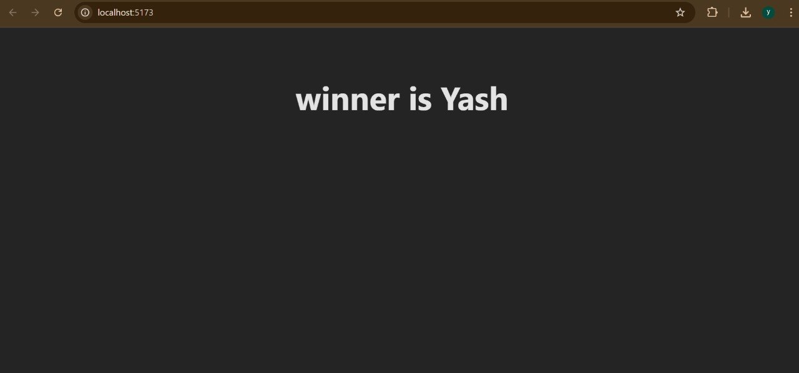

# Fact Frenzy

Fact Frenzy is an interactive web application that delivers fascinating facts across various topics. Designed for curious minds, it features a sleek, user-friendly interface powered by React and Vite.
Multiplayer Quiz Game

## Features
- **Random Facts:** Explore an ever-changing array of intriguing facts.
- **Interactive UI:** Seamless navigation and intuitive design.
- **Responsive Design:** Accessible on all devices, from desktop to mobile.

## Installation
1. **Clone the Repository:**
   ```bash
   git clone https://github.com/Shrivastava19/Fact-frenzy.git






Navigate to the Directory:
cd Fact-frenzy

Install Dependencies:
Copy code
npm install

Run the Development Server:
npm run dev

Access the App: Open your browser and go to http://localhost:3000.

***Contributing***
Fork the repository.
Create a new branch: git checkout -b feature-name.
Make changes, then commit: git commit -m 'Description of changes'.
Push changes: git push origin feature-name.
Open a pull request.

